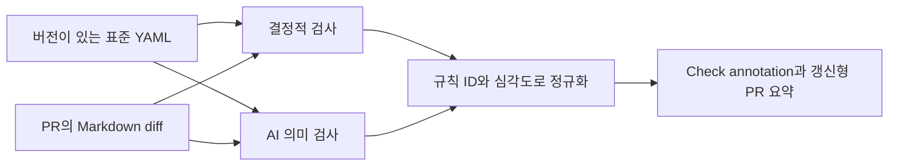

# technical-writing-review

Markdown과 MDX 문서의 PR 변경분을 회사 표준에 맞춰 리뷰하는 GitHub Action입니다. 같은 문장을 매번 AI의 취향으로 고치는 대신, 버전이 있는 표준 파일을 기준으로 재현 가능한 규칙과 AI 의미 검사를 분리합니다.

## 표준화하는 범위

| 검사 계층 | 적합한 기준 | 결과 | 병합 차단 |
|---|---|---|---|
| 결정적 검사 | H1, 개요, 제목 단계, 필수 섹션, 메타데이터, 금칙어와 표준 용어 | `[필수]`, `[권장]` | `[필수]`만 선택 가능 |
| AI 의미 검사 | 목적·독자·범위, 기술적 주장 확인, 문장 명확성, 문서 유형 적합성 | `[권장]`, `[확인]` | 불가능 |

모든 판정에는 `TW-ARCH-001` 같은 규칙 ID가 붙습니다. PR에서는 변경된 줄과 이번 변경으로 새로 생긴 문서 단위 위반만 보고하므로, 기존 문서의 부채가 새 PR을 가로막지 않습니다.



실제 판정 기준은 [`standards/technical-writing.yml`](standards/technical-writing.yml)에 있고, [`references/tw-principles/`](references/tw-principles/)에는 기준을 만든 배경과 작성 예시가 있습니다.

## 로컬에서 테스트하기

Node.js 24와 Git이 필요합니다.

```bash
npm ci
npm test
npm run eval
```

- `npm test`: 파서, 규칙 판정, Git diff, AI 결과 검증, PR 리포트의 자동 테스트를 실행합니다.
- `npm run eval`: `evals/`의 좋은 문서와 위반 문서가 기대한 규칙 ID로 판정되는지 검사합니다.
- `npm run all`: 테스트와 평가를 실행하고 GitHub Action용 `dist/` 번들을 만듭니다.

현재 파일 전체를 검사하려면 다음 명령을 실행합니다.

```bash
npm run review -- docs/guide.md
npm run review -- docs/guide.md --json
```

두 Git revision 사이의 PR 동작을 재현할 수도 있습니다.

```bash
npm run review -- --base main --head HEAD
npm run review -- --base main --head HEAD --fail
```

`--fail`은 `[필수]` 위반이 있을 때 종료 코드 1을 반환합니다. 파일을 직접 검사하는 방식은 파일 전체를, revision 비교 방식은 새로 도입된 위반만 검사합니다.

## 저장소에 설치하기

먼저 이 저장소를 사내 GitHub에 올리고 릴리스 커밋을 정합니다. 사용하는 저장소에서 버전 태그보다 전체 commit SHA를 고정하면 Action 공급망 변경을 명시적으로 통제할 수 있습니다.

```yaml
# .github/workflows/technical-writing-review.yml
name: Technical writing review

on:
  pull_request:
    types: [opened, synchronize, reopened]
    paths:
      - "**/*.md"
      - "**/*.mdx"

permissions:
  contents: read
  pull-requests: write

jobs:
  review:
    runs-on: ubuntu-latest
    steps:
      - uses: actions/checkout@v6
        with:
          fetch-depth: 0

      - uses: YOUR_ORG/technical-writing-review@FULL_COMMIT_SHA
        with:
          github-token: ${{ github.token }}
          anthropic-api-key: ${{ secrets.ANTHROPIC_API_KEY }}
          fail-on-required: "false"
```

`ANTHROPIC_API_KEY`를 등록하지 않으면 결정적 검사만 실행됩니다. fork PR에는 저장소 secret이 전달되지 않으므로 AI 검사는 자동으로 건너뛰며, 읽기 전용 토큰으로 PR 요약을 쓸 수 없을 때도 판정 자체는 계속 실행됩니다.

처음에는 `fail-on-required: "false"`로 결과만 수집하는 편이 안전합니다. 팀이 규칙을 합의하고 오탐을 조정한 뒤 `true`로 바꾸고, 해당 워크플로우를 branch protection의 required check로 지정하세요.

## 회사 표준 적용하기

기본 파일을 사용하는 저장소로 복사합니다.

```bash
mkdir -p .github
cp standards/technical-writing.yml .github/technical-writing.yml
```

Action 입력에 경로를 지정합니다.

```yaml
with:
  standard-path: .github/technical-writing.yml
```

팀에 맞게 다음 항목부터 조정하면 됩니다.

- `document_type.require_explicit_type`: 모든 문서가 유형을 명시하게 할지 결정합니다.
- `document_type.types.*.required_sections`: 유형별 고정 골격을 정의합니다.
- `metadata.required`: `owner`, `last_reviewed_at` 같은 frontmatter 필드를 요구합니다.
- `terminology.terms`: 권장 용어와 금지할 대체 표현을 등록합니다.
- `sentence`: 단순하고 재현 가능한 문장 패턴을 등록합니다.
- `semantic_rules`: AI가 판단할 의미 기준을 정의합니다. 스키마상 `[필수]`로 설정할 수 없습니다.

명시적인 문서 유형은 frontmatter로 지정합니다.

```markdown
---
document_type: problem-solving
owner: platform-team
---

# `AUTH_001` 오류 해결

이 문서를 따르면 만료된 인증 토큰을 교체하고 정상 동작을 확인할 수 있습니다.
```

표준을 바꿀 때는 `version`을 올리고 `evals/`에 최소 한 개의 통과 또는 실패 사례를 추가하세요. PR 결과에 표준 버전이 기록되므로 어느 기준으로 판정했는지 추적할 수 있습니다.

사용자 표준은 PR의 `base` revision에 있는 파일로 판정합니다. 같은 PR에서 규칙을 끄거나 심각도를 낮춰 검사를 우회할 수 없으며, `head` revision의 파일도 별도로 파싱해 잘못된 YAML이 병합되는 것을 막습니다. 따라서 표준 변경은 병합된 다음 PR부터 적용됩니다.

## Action 입력과 출력

주요 입력은 다음과 같습니다.

| 입력 | 기본값 | 설명 |
|---|---|---|
| `github-token` | 없음 | 갱신 가능한 PR 요약 코멘트를 작성합니다. |
| `anthropic-api-key` | 없음 | 있으면 AI 의미 검사를 실행합니다. |
| `model` | `claude-sonnet-5` | 의미 검사 모델입니다. |
| `standard-path` | 내장 표준 | 호출 저장소의 표준 YAML 경로입니다. |
| `fail-on-required` | `false` | 결정적 `[필수]` 위반으로 작업을 실패시킵니다. |
| `comment` | `true` | PR 요약 코멘트를 작성합니다. |
| `ai-review` | `true` | AI 의미 검사를 활성화합니다. |
| `max-ai-findings` | `5` | 한 PR의 AI 결과 상한입니다. |

`status`, `required-count`, `recommended-count`, `confirmation-count`, `standard-version`을 출력합니다. 전체 입력은 [`action.yml`](action.yml)에서 확인할 수 있습니다.

## 운영 시 주의할 점

- AI에는 변경된 diff와 문서 문맥이 전송됩니다. 사내 보안·개인정보 정책에 맞는 문서만 대상으로 사용하세요.
- 결정적 검사는 모든 변경 문서를 검사하고, AI 검사는 비용과 지연을 제한하기 위해 내용이 바뀐 문서 중 앞의 20개까지만 검사합니다.
- AI 응답은 허용된 규칙 ID, 파일, 변경 라인, 원문, 신뢰도 기준을 다시 검증합니다. 그래도 의미 판단은 비결정적이므로 병합 차단에 사용하지 않습니다.
- 요약 코멘트는 고정 마커를 찾아 갱신하므로 PR 동기화마다 코멘트가 쌓이지 않습니다. 각 결과는 GitHub Check annotation으로도 표시됩니다.
- workflow와 사용자 표준 파일에는 CODEOWNERS와 branch protection을 적용해 승인 없이 검사 정책이나 secret 사용 방식을 바꾸지 못하게 하세요.
- 이 저장소에서 `src/`를 변경했다면 `npm run bundle`을 실행해 `dist/`도 함께 커밋해야 합니다. CI가 번들 차이를 검사합니다.
